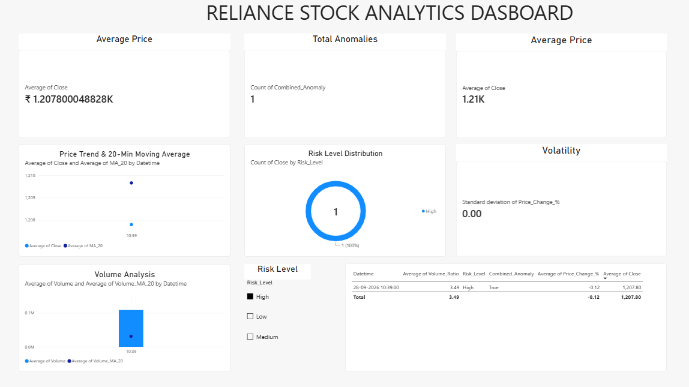

# Realtime Stock Analytics Dashboard

## 📌 Project Overview

Realtime Stock Analytics is a beginner-friendly data analytics project that collects stock market data and analyzes price movement, volatility, moving averages, trading volume, anomalies, and risk levels.

The project uses Python for data collection and analysis and Power BI for creating an interactive dashboard.

## 🛠️ Technologies Used

* Python
* Pandas
* yfinance
* Power BI
* SQL
* Excel / CSV

## 📊 Data Source

Stock market data is collected using the Yahoo Finance API through the Python `yfinance` library.

Currently, the project analyzes:

**Stock:** Reliance Industries
**Ticker:** RELIANCE.NS
**Interval:** 1 minute

## ⚙️ Project Features

### 1. Stock Data Collection

`fetch_data.py` collects intraday stock market data and saves it as a CSV file.

### 2. Price Analysis

Calculates the percentage change between the opening and closing price.

### 3. Volatility Analysis

Measures price movement volatility using the standard deviation of price changes.

### 4. Moving Average

Calculates a 20-period moving average of the closing price.

### 5. Volume Analysis

Calculates the 20-period average volume and volume ratio.

### 6. Anomaly Detection

Identifies unusual market activity using price movement and volume conditions.

### 7. Risk Analysis

Classifies market activity into:

* Low Risk
* Medium Risk
* High Risk

### 8. SQL Analysis
SQL is used to perform additional analysis on the processed stock data.

The SQL queries include:

- Highest and lowest closing price
- Average closing price
- Total trading volume
- Anomaly count
- Risk level distribution
- High-risk records
- Unusual volume detection
- Highest volume records

SQL queries are available in:

`sql/stock_analysis.sql`

### 9. Power BI Dashboard

The processed data is used to create an interactive dashboard containing:

* KPI Cards
* Price Trend
* Volume Analysis
* Close vs MA_20
* Risk Level Slicer
* Anomaly Detection Table



## 📁 Project Structure

```text
Realtime_stock_Analytics
│
├── .venv
│
├── data
│   ├── reliance_1min.csv
│   └── reliance_processed.csv
│
├── python
│   ├── fetch_data.py
│   ├── price_analysis.py
│   ├── volatility_analysis.py
│   ├── moving_average.py
│   ├── volume_analysis.py
│   ├── anomaly_detection.py
│   ├── risk_analysis.py
│   └── process_data.py
│
├── sql
│
└── README.md
```

## 🔄 How the Project Works

```text
Yahoo Finance
      ↓
fetch_data.py
      ↓
Raw CSV Data
      ↓
process_data.py
      ↓
Processed CSV Data
      ↓
Power BI
      ↓
Interactive Stock Analytics Dashboard
```

## 📈 Current Processing Results

For the current Reliance Industries dataset:

* Rows processed: 113
* Volatility: 0.0554%
* Low Risk records: 108
* Medium Risk records: 4
* High Risk records: 1
* Combined anomalies: 1

## 🚀 How to Run

### Step 1 — Activate virtual environment

```powershell
.venv\Scripts\activate
```

### Step 2 — Fetch stock data

```powershell
python python\fetch_data.py
```

### Step 3 — Process the data

```powershell
python python\process_data.py
```

The processed file will be created at:

```text
data\reliance_processed.csv
```

### Step 4 — Open Power BI

Load `reliance_processed.csv` into Power BI and refresh the dashboard.

## 🎯 Key Learning

Through this project, I practiced:

* Python data collection
* Pandas data processing
* Stock market data analysis
* Moving averages
* Volatility analysis
* Volume analysis
* Anomaly detection
* Risk classification
* Power BI dashboard development
* Data visualization

## 👨‍💻 Project Goal

The goal of this project is to demonstrate practical skills in Python, data analysis, SQL, and Power BI by building a stock analytics dashboard using real market data.
